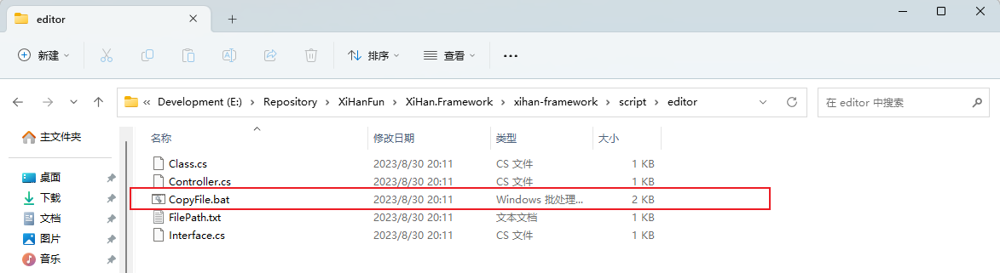
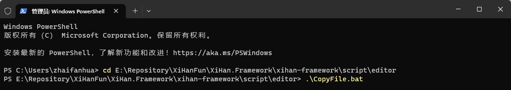
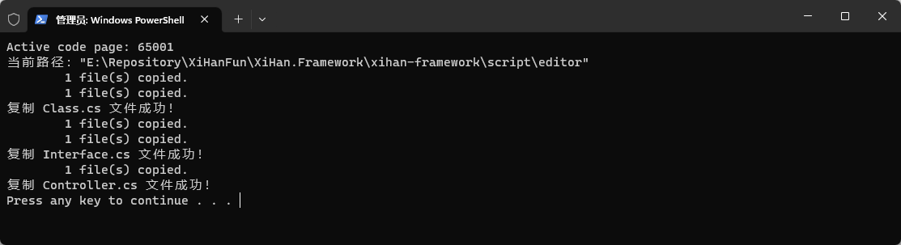

## 后端开发环境

### 安装开发工具

- 下载 Visual Studio 2022 并安装，下载[传送门](https://visualstudio.microsoft.com/zh-hans/downloads/)；

- 下载 Visual Studio 2022 的 CodeMaid 扩展插件，下载[传送门](https://marketplace.visualstudio.com/items?itemName=SteveCadwallader.CodeMaidVS2022)，这个插件可以自动格式化代码；

- `若有新功能开发`，请添加文件头，这在后续修改代码文件或多人合作项目时有莫大的好处。如下为我的示例：

> 注意：我所用环境为 Visual Studio 2022，以下模板适合 C#10 新语法，旧语法及旧版本以类似方法修改。

```csharp
#region <<版权版本注释>>

// ----------------------------------------------------------------
// Copyright ©2023 ZhaiFanhua All Rights Reserved.
// Licensed under the MulanPSL2 License. See LICENSE in the project root for license information.
// FileName:ChatHub
// Guid:ee669dee-30c7-4d21-8eb4-f24d8dc0f44c
// Author:zhaifanhua
// Email:me@zhaifanhua.com
// CreatedTime:2023-04-16 上午 03:59:25
// ----------------------------------------------------------------

#endregion <<版权版本注释>>
```

下面就来说说怎么创建并修改默认模板。

### 安装 Git

下载 Git 并安装，下载[传送门](https://git-scm.com/downloads)

### 项目 clone

```shell
git clone https://github.com/XiHanFun/XiHan.Framework.git
```

通过管理员权限运行 power shell，打开 【克隆根目录\XiHan.Framework\xihan-framework\script\editor】，并运行 CopyFile.bat 可一键修改。



运行

```shell
 cd [克隆根目录]\XiHan.Framework\xihan-framework\script\editor
 .\CopyFile.bat
```



运行成功界面



至此，后端开发环境搭建完成。
